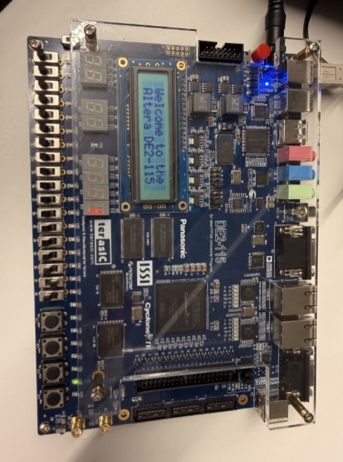
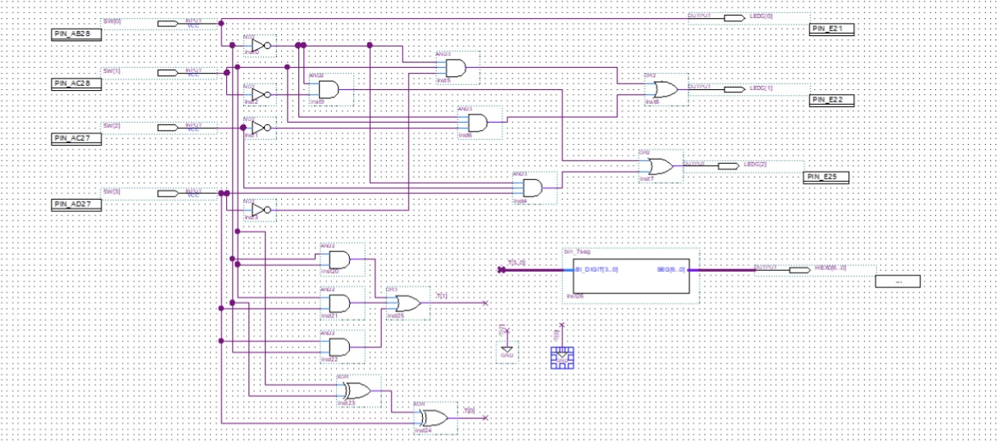
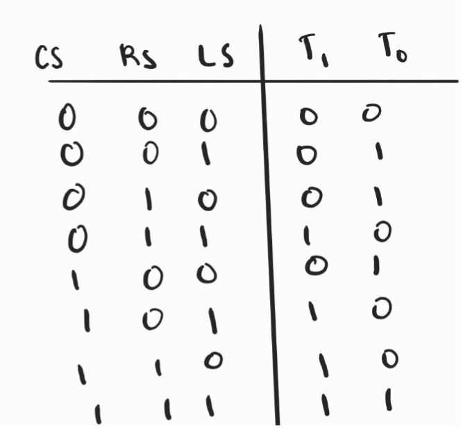
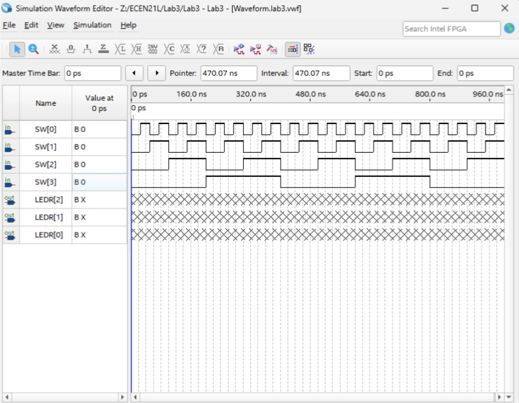
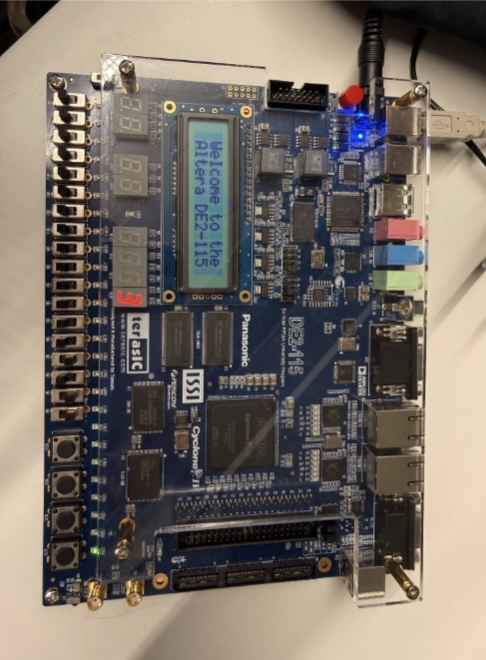
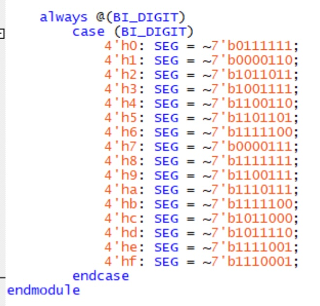

# FPGA Traffic Light Controller

A digital logic and FPGA implementation of a three-lane traffic metering controller using Verilog and an Intel DE2-115 FPGA.

## Overview

This project implements a traffic metering controller for a three-lane highway entrance ramp. The controller determines which lane receives a green light based on vehicle sensor inputs and a round-robin selection signal.

The design was developed from a functional specification, translated into Boolean logic, simplified using Karnaugh maps, simulated in Quartus Prime, and implemented on physical FPGA hardware.

## System Architecture

The controller manages three lanes:

- **Carpool Lane (CL)**
- **Left Lane (LL)**
- **Right Lane (RL)**

### Inputs

| Input | Description |
|---|---|
| `CS` | Carpool lane vehicle sensor |
| `LS` | Left lane vehicle sensor |
| `RS` | Right lane vehicle sensor |
| `RR` | Round-robin lane selection |

### Outputs

| Output | Description |
|---|---|
| `CL` | Carpool lane green light |
| `LL` | Left lane green light |
| `RL` | Right lane green light |

## Traffic Control Logic

The controller follows these priority rules:

1. The carpool lane receives priority when a vehicle is detected.
2. When the carpool lane is empty, the controller selects between the left and right lanes.
3. When both regular lanes have vehicles waiting, the `RR` signal determines which lane receives the green light.
4. When no vehicles are waiting, the right lane remains green.

## Design Process

The circuit was developed through the following engineering workflow:

**Problem Specification → Truth Table → Karnaugh Maps → Boolean Logic → Gate-Level Schematic → Simulation → FPGA Implementation → Hardware Testing**

## Logic Design

The controller was implemented using minimized combinational logic and AND/OR gate structures.

The logic was derived from the specified traffic-control behavior and simplified using Karnaugh maps before implementation.

## Simulation & Verification

The design was tested against all 16 possible combinations of the four input signals.

Testing the complete input space provided a way to compare the circuit behavior against the expected truth table before implementing the design on physical hardware.

## FPGA Hardware Implementation

The final design was implemented on an Intel/Altera DE2-115 FPGA development board.

The board switches were used as circuit inputs, while the LEDs represented the traffic-light outputs.

## 7-Segment Display

A 7-segment display was implemented to indicate the number of vehicles detected by the three lane sensors.

The display represents vehicle counts from **0–3**.

The Verilog implementation for the hexadecimal 7-segment decoder is included in the `code` directory.

## Technologies

- **Verilog HDL**
- **Quartus Prime**
- **Intel/Altera DE2-115 FPGA**
- **Digital Logic Design**
- **Boolean Algebra**
- **Karnaugh Maps**
- **AND/OR Gate Logic**
- **7-Segment Displays**
- **FPGA Simulation**

## Engineering Skills Demonstrated

- Translating functional requirements into digital logic
- Constructing and simplifying Boolean functions
- Designing combinational logic
- Writing Verilog HDL
- Simulating and verifying hardware behavior
- FPGA implementation
- Hardware testing and debugging
- Working with 7-segment displays and physical I/O

## Lessons Learned

This project provided hands-on experience translating a functional specification into a working digital system.

One of the most valuable parts of the project was comparing simulated behavior with the physical FPGA implementation. This reinforced the importance of verification, hardware configuration, and testing when moving from a logical design to a physical system.
